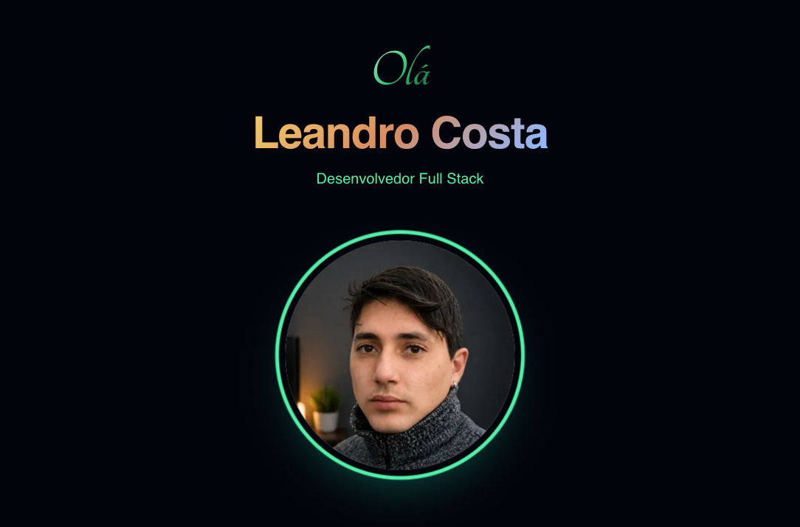

<p align="center">
  <a href="https://www.techlcosta.dev/pt">
    
  </a>
</p>

<h1 align="center">TechLCosta.dev</h1>

<p align="center">
  Portfólio multilíngue de <strong>Leandro Costa</strong>, desenvolvedor Full Stack baseado no Japão.
</p>

<p align="center">
  <a href="https://www.techlcosta.dev/pt">Deploy</a>
  ·
  <a href="https://www.techlcosta.dev/pt/blog">Blog</a>
  ·
  <a href="https://github.com/techlcosta">GitHub</a>
  ·
  <a href="https://www.linkedin.com/in/techlcosta">LinkedIn</a>
</p>

<p align="center">
  
  
  
  
</p>

## Sobre

Este projeto é a landing page pessoal da TechLCosta: uma experiência editorial escura, responsiva e internacionalizada para apresentar perfil, skills, projetos e artigos técnicos.

O site combina App Router, MDX, animações sutis, dock de navegação e uma nuvem 3D de tecnologias para criar um portfólio com presença visual sem perder performance e simplicidade de manutenção.

## Destaques

- Rotas em português, inglês e japonês com redirecionamento por idioma.
- Blog técnico com conteúdo em MDX e páginas estáticas por locale.
- Hero com imagem otimizada via `next/image` e microdados de pessoa.
- Seção de skills baseada em ícones SVG locais e visualização interativa.
- Cards de projetos com stack, preview e links externos.
- UI com Radix, Lucide, Tailwind CSS 4 e componentes reutilizáveis.

## Stack

| Camada | Tecnologias |
| --- | --- |
| Framework | Next.js 16, React 19, App Router |
| Linguagem | TypeScript |
| Estilo | Tailwind CSS 4, tw-animate-css, tailwind-merge |
| Conteúdo | MDX, mensagens i18n em JSON |
| UI | Radix UI, Lucide React, shadcn-style components |
| Movimento | Motion |
| Qualidade | ESLint, Prettier, eslint-config-next |

## Rodando localmente

```bash
pnpm install
pnpm dev
```

Abra [http://localhost:3000](http://localhost:3000) no navegador. O projeto usa Node.js `24.x`, conforme definido em `package.json`.

## Scripts

```bash
pnpm dev          # inicia o servidor de desenvolvimento
pnpm build        # gera a build de produção
pnpm start        # serve a build localmente
pnpm lint         # executa ESLint
pnpm lint:fix     # corrige problemas de lint quando possível
pnpm format       # formata o projeto com Prettier
pnpm format:check # valida formatação
```

## Estrutura

```txt
app/
  [lang]/          # rotas internacionalizadas do portfólio e blog
components/        # hero, navegação, skills, projetos e UI primitives
content/blog/      # artigos MDX separados por idioma
i18n/              # locales, dicionários e mensagens
lib/               # utilitários e carregamento dos posts
public/            # imagens, ícones e assets estáticos
proxy.ts           # detecção e redirecionamento de idioma
```

## Deploy

O deploy principal está em [techlcosta.dev](https://www.techlcosta.dev/pt), com rotas disponíveis em:

- [Português](https://www.techlcosta.dev/pt)
- [English](https://www.techlcosta.dev/en)
- [日本語](https://www.techlcosta.dev/ja)
